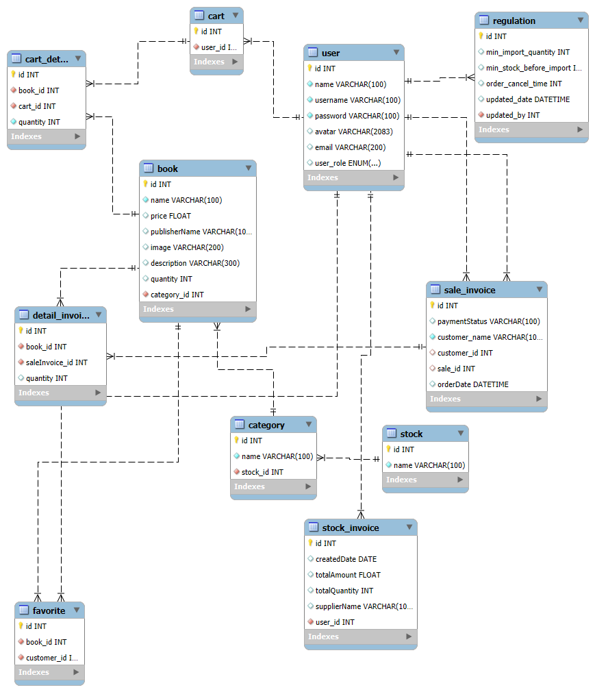

# 📚 Quản Lý Nhà Sách

Dự án **Quản Lý Nhà Sách** là một ứng dụng web giúp quản lý hoạt động của nhà sách, bao gồm quản lý sách, khách hàng, đơn hàng và báo cáo doanh thu.  
Ứng dụng được phát triển bằng Python và Flask, với giao diện người dùng sử dụng HTML, CSS và JavaScript.

## 🚀 Tính Năng

- Quản lý thông tin sách: thêm, sửa, xóa sách.
- Quản lý khách hàng: lưu trữ và cập nhật thông tin khách hàng.
- Xử lý đơn hàng: tạo và quản lý đơn hàng bán sách.
- Báo cáo doanh thu: thống kê doanh thu theo ngày, tháng, năm.
- Giao diện người dùng thân thiện và dễ sử dụng.

## 🛠️ Công Nghệ Sử Dụng

- **Backend**: Python, Flask  
- **Frontend**: HTML, CSS, JavaScript  
- **Cơ sở dữ liệu**: SQLite (có thể nâng cấp lên PostgreSQL hoặc MySQL)  
- **Thư viện**: Flask, SQLAlchemy, Jinja2

## 📂 Cấu Trúc Thư Mục
```
QuanLyNhaSach/
├── bookstoremanagement/   # Thư mục chính chứa mã nguồn
│   ├── data/              # Tệp tĩnh: chứa data mẫu
│   ├── static/            # Tệp tĩnh: CSS, JS, hình ảnh
│   ├── templates/         # Giao diện HTML
│   ├── __init__.py        # Khởi tạo ứng dụng Flask
│   ├── dao.py             # Định nghĩa các hàm 
│   ├── admin.py           # Cấu hình trang quản trị
│   ├── models.py          # Định nghĩa mô hình dữ liệu
│   ├── bookstore.png      # Hình ảnh ERD
│   ├── index.py           # Định nghĩa các route
├── requirements.txt       # Danh sách các gói phụ thuộc
└── README.md              # Tệp hướng dẫn 
```
## ⚙️ Cài Đặt và Chạy Ứng Dụng

1. **Clone** dự án:

```bash
git clone https://github.com/HoDucLinh/QuanLyNhaSach.git
cd QuanLyNhaSach
```

2. **Tạo và kích hoạt môi trường ảo**:

```bash
python -m venv venv
source venv/bin/activate  # Trên Windows: venv\Scripts\activate
```

3. **Cài đặt các gói phụ thuộc**:

```bash
pip install -r requirements.txt
```

4. **Chạy ứng dụng**:

```bash
flask run
```

5. Mở trình duyệt và truy cập: http://localhost:5000

## 📸 Mô Hình ERD
Hình ảnh bên dưới mô tả mô hình thực thể quan hệ (ERD) của hệ thống quản lý nhà sách:



## 👨‍💻 Tác Giả
HoDucLinh - hoduclinh080204@gmail.com
nguyenhung18
Nguyễn Quang Khánh

## 📌 Ghi Chú
- Dự án hiện đang trong quá trình phát triển và có thể chưa đầy đủ tính năng.

- Đóng góp và phản hồi từ cộng đồng được hoan nghênh để cải thiện dự án.

- Không thực hiện đóng góp lên nhánh main . Xin cảm ơn
